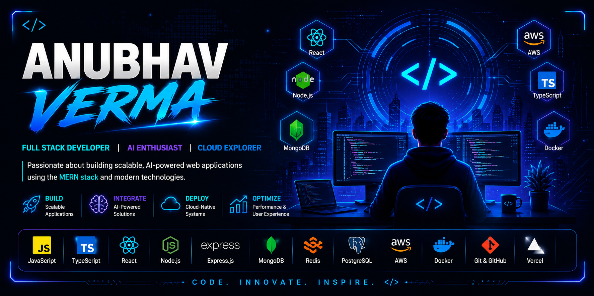

  

 
 

 
   

#  About Me:
👋 Hi, I'm Anubhav Verma  I'm a Full-Stack Developer passionate about building scalable and AI-powered web applications using React, JavaScript, Node.js, Express.js, MongoDB, and modern web technologies.  Recently, I built "DocuMind AI", an AI-powered document question-answering platform that enables users to upload PDFs and interact with them using Retrieval-Augmented Generation (RAG). The application integrates Groq's LLaMA model with vector embeddings to deliver fast, context-aware responses through a modern React interface.  I have also developed projects including a Smart Productivity Planner", featuring task management, habit tracking, Pomodoro timer, voice input, and offline support to enhance personal productivity.  My experience includes working on full-stack MERN applications, designing REST APIs, implementing secure JWT authentication, integrating AI services, and deploying applications using Vercel, Render, and MongoDB Atlas.  Currently, I'm exploring AWS, Docker, TypeScript, system design, and scalable backend architecture while continuously building real-world projects and strengthening my problem-solving skills.  I'm always excited to learn new technologies, contribute to impactful projects, and collaborate with developers across the open-source community. 

## 🌐 Socials:
  

# Tech Stack

## Languages

## Frontend

## Backend & Databases

## Cloud, DevOps & Tooling

---

# Skill Icons

---
# GitHub Analytics

  

# 🌐Live Projects

<b>🤖 DocuMind AI - AI Powered Document Intelligence Platform</b>

 

An AI-powered full-stack document intelligence platform that allows users to upload PDF, DOCX, PPTX, XLSX, and TXT files and interact with them using natural language. Built using a Retrieval-Augmented Generation (RAG) pipeline with semantic search for fast and context-aware responses.

| Category | Details |
|---|---|
| Stack | React.js, Node.js, Express.js, MongoDB, Groq LLaMA 3.3 |
| AI | RAG Pipeline, Vector Embeddings, Cosine Similarity Search |
| Documents | PDF, DOCX, PPTX, XLSX, TXT |
| Authentication | JWT Authentication |
| Database | MongoDB Atlas |
| Deployment | Vercel, Render, MongoDB Atlas |
| Live Demo | https://documind-ai-project-011.vercel.app |
| Repository | https://github.com/Anubhavverma2/documind-ai |

### 🚀 Key Features

- 📄 Upload multiple document formats
- 🤖 AI-powered question answering using Groq LLaMA 3.3
- 🧠 Retrieval-Augmented Generation (RAG)
- 🔍 Vector embeddings with cosine similarity search
- ⚡ Top-5 semantic document retrieval
- 🔐 JWT Authentication & Protected Routes
- ☁️ Fully deployed on Vercel, Render & MongoDB Atlas
- 📱 Responsive modern UI

---

<!-- Proudly created with GPRM ( https://gprm.itsvg.in ) -->
